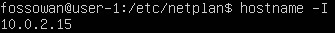
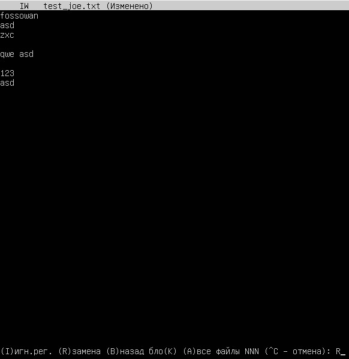
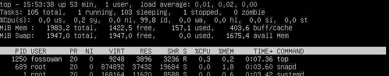
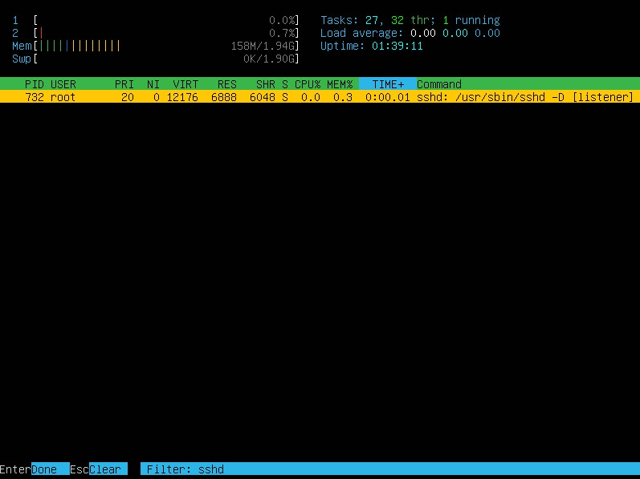
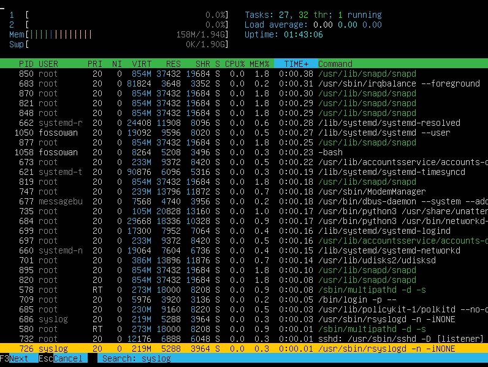
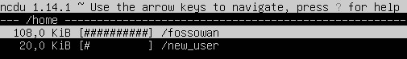
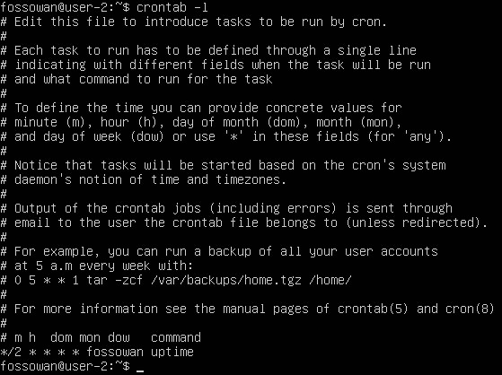

## Part 1. Установка ОС
##### Установить **Ubuntu 20.04 Server LTS** без графического интерфейса. (Используем программу для виртуализации - VirtualBox).
**== Задание ==**
1) Графический интерфейс должен отсутствовать.
2) Узнайте версию Ubuntu, выполнив команду 
`cat /etc/issue.`
3) Вставьте скриншот с выводом команды.

**== Решение ==**

- Для вывода версии Ubuntu необходимо ввести команду `cat /etc/issue` .\

## Part 2. Создание

**== Задание ==**

##### Создать пользователя, отличного от пользователя, который создавался при установке. Пользователь должен быть добавлен в группу `adm`.
1) Вставьте скриншот вызова команды для создания пользователя.
2) Новый пользователь должен быть в выводе команды \
`cat /etc/passwd`
3) Вставьте скриншот с выводом команды.

**== Решение ==**

- Для создания нового пользователя была введена команда `sudo adduser new_user`, где `new_user` - имя нового пользователя. \

- Для добавления пользователя в группу `adm` использовалась команда `usermod -a -G adm new_user` .
- Результат вывода команды `cat /etc/passwd`: \

## Part 3. Настройка сети 
**== Задание 1 ==**

##### Задать название машины вида user-1

**== Решение ==**
- Для задания названия машины использовалась следующая команда для редактирования файла через текстовый редактор vim : `sudo vim /etc/hostname` \

- В текстовом редакторе после перехода в режим редактирование клавишей `i` изменялось имя пользователя. Для сохранения результата выход из реадктора был осуществлен нажатием `:wq Enter`.
- Для применения изменений система перезагружалась командой `sudo reboot` .

**== Задание 2 ==**

##### Установить временную зону, соответствующую вашему текущему местоположению.

**== Решение ==**

- Для установки временной зоны на соответствующую текущему местоположению использовалась команда `sudo timedatectl set-timezone Europe/Moscow` \

**== Задание 3 ==**

##### Вывести названия сетевых интерфейсов с помощью консольной команды. В отчёте дать объяснение наличию интерфейса lo.

1) В отчёте дать расшифровку DHCP.

**== Решение ==**

- Для вывода названия сетевых интерфейсов можно воспользоваться командой `ls /sys/class/net/` или `ip link show` . \

- Интерфейс `lo` (loopback device) - виртуальный интерфейс, присутствующий по умолчанию в любом Linux. Он используется для отладки сетевых программ и запуска серверных приложений на локальной машине. 

**== Задание 4 ==**

##### Используя консольную команду получить ip адрес устройства, на котором вы работаете, от DHCP сервера.

1) В отчёте дать расшифровку DHCP.

**== Решение ==**

- Для вывода ip адреса использовалась команда `ip address` или `hostname -I` \

- DHCP (Dynamic Host Configuration Protocol) - протокол динамической настройки узла.

**== Задание 5 ==**

##### Определить и вывести на экран внешний ip-адрес шлюза (ip) и внутренний IP-адрес шлюза, он же ip-адрес по умолчанию (gw).

**== Решение ==**

- Для вывода внешнего ip-адреса шлюза используется команда `curl ifconfig.me/ip`\

- Для вывода внутреннего ip-адреса шлюза используется команда `ip route`\

**== Задание 6 ==**

##### Задать статичные (заданные вручную, а не полученные от DHCP сервера) настройки ip, gw, dns (использовать публичный DNS серверы, например 1.1.1.1 или 8.8.8.8). 

**== Решение ==**

- Для того чтобы задать указанные настройки, необходимо узнать ip через команду `ip a`

- Необходимо отредактировать файл из каталога `/etc/netplan/` с расширением `YAML` . В моём случае использовалась команда `sudo vim /etc/netplan/00-installer-config.yaml`. В файле необходимо задать следующие настройкии: \

- Для того, чтобы изменения вступили в силу, необходимо использовать команду `sudo netplan apply` .

**== Задание 7 ==**

##### Перезагрузить виртуальную машину. Убедиться, что статичные сетевые настройки (ip, gw, dns) соответствуют заданным в предыдущем пункте.

1) В отчёте опишите, что сделали для выполнения всех семи пунктов (можно как текстом, так и скриншотами).
2) Успешно пропинговать удаленные хосты 1.1.1.1 и ya.ru и вставить в отчёт скрин с выводом команды. В выводе команды должна быть фраза "0% packet loss".

**== Решение ==**

- После перезагрузки виртуальной машины командой `sudo reboot now` можно убедиться в том, что внесенный изменения вступили в силу. Для этого пингуем удаленные хосты 1.1.1.1 и ya.ru :\

## Part 4. Обновление ОС
**== Задание ==**

##### Обновить системные пакеты до последней на момент выполнения задания версии.  

1) После обновления системных пакетов, если ввести команду обновления повторно, должно появится сообщение, что обновления отсутствуют.
2) Вставить скриншот с этим сообщением в отчёт.

**== Решение ==**

- Для обновления системных пакетов необходимо получить их последние версии командой `sudo apt update` . После этого можно обновить системные пакеты командой `sudo apt upgrade` .
- При повторном вводе команды `sudo apt upgrate` появится информация о том, что обновления отсутствуют : \

## Part 5. Использование команды **sudo*
**== Задание ==**

##### Разрешить пользователю, созданному в Part 2, выполнять команду sudo.
1) В отчёте объяснить *истинное* назначение команды sudo (про то, что это слово - "волшебное", писать не стоит).  
2) Поменять hostname ОС от имени пользователя, созданного в пункте Part 2 (используя sudo).
3) Вставить скрин с изменённым hostname в отчёт.

**== Решение ==**

- Для предоставления пользователю доступа к команде `sudo` использовалась команда `sudo usermod -aG sudo new_user` .
- **Sudo** (*Substitute User and do*) - программа для системного администрирования UNIX-систем, позволяющая делегировать те или иные привилегированные ресурсы пользователям с ведением протокола работы. Основная идея — дать пользователям как можно меньше прав, при этом достаточных для решения поставленных задач.
- Изменить имя можно открыв файл командой `sudo -u new_user sudo vim /etc/hostname` и изменив имя hostname.

## Part 6. Установка и настройка службы времени

**== Задание ==**

##### Настроить службу автоматической синхронизации времени.  

1) Вывести время, часового пояса, в котором вы сейчас находитесь.
2) Вывод следующей команды должен содержать `NTPSynchronized=yes`: \
  `timedatectl show`
3) Вставить скрины с корректным временем и выводом команды в отчёт.

**== Решение ==**

## Part 7. Установка и использование текстовых редакторов 
**== Задание 1 ==**

##### Установить текстовые редакторы **VIM** (+ любые два по желанию **NANO**, **MCEDIT**, **JOE** и т.д.)  
##### Используя каждый из трех выбранных редакторов, создайте файл *test_X.txt*, где X -- название редактора, в котором создан файл. Напишите в нём свой никнейм, закройте файл с сохранением изменений.
1) В отчёт вставьте скриншоты:
    - Из каждого редактора с содержимым файла перед закрытием.
2) В отчёте укажите, что сделали для выхода с сохранением изменений.

**== Решение ==**

- **Vim** : cоздание файла: `vim test_vim.txt` , редактирование `i`, выход с сохранением `:wq` \

- **NANO** : cоздание файла: `nano test_nano.txt` , сохранение `ctrl + O`, выход `ctrl + X` \

- **JOE** : cоздание файла: `joe test_joe.txt` , выход `ctrl + KQ` и сохранение `y`\

**== Задание 2 ==**

##### Используя каждый из трех выбранных редакторов, откройте файл на редактирование, отредактируйте файл, заменив никнейм на строку "21 School 21", закройте файл без сохранения изменений.
1) В отчёт вставьте скриншоты:
    - Из каждого редактора с содержимым файла после редактирования.
2) В отчёте укажите, что сделали для выхода без сохранения изменений.

**== Решение ==**

- **Vim** : Выход без сохранения `:q!` \

- **NANO** : Выход `ctrl + X` без сохранения `N`\

- **JOE** : Выход `ctrl + KQ` без сохранения `n`\

**== Задание 3 ==**

##### Используя каждый из трех выбранных редакторов, отредактируйте файл ещё раз (по аналогии с предыдущим пунктом), а затем освойте функции поиска по содержимому файла (слово) и замены слова на любое другое.
1) В отчёт вставьте скриншоты:
    - Из каждого редактора с результатами поиска слова.
    - Из каждого редактора с командами, введёнными для замены слова на другое.

**== Решение ==**

- **Vim** : Поиск по слову: `:s/pattern` , замена слова: `:s/pattern_1/pattern_2/` , замена во всём файле: `:%s/pattern_1/pattern_2/g`\
 \

- **NANO** : Поиск по слову: `ctrl + W` , замена слова: `alt + R` -> слово, которое надо заменить -> слово, на которое надо заменить\
 \

- **JOE** : Поиск по слову: `ctrl + K + F` , замена слова: `alt + R` -> слово, которое надо заменить -> слово, на которое надо заменить\
 \
 \
 \

## Part 8. Установка и базовая настройка сервиса **SSHD**

**== Задание ==**

##### Установить службу SSHd.  
##### Добавить автостарт службы при загрузке системы.  
##### Перенастроить службу SSHd на порт 2022.  
##### Используя команду ps, показать наличие процесса sshd. Для этого к команде нужно подобрать ключи.
- В отчёте объяснить значение команды и каждого ключа в ней.
##### Перезагрузить систему.
- В отчёте опишите, что сделали для выполнения всех пяти пунктов (можно как текстом, так и скриншотами).
- Вывод команды netstat -tan должен содержать  \
`tcp 0 0 0.0.0.0:2022 0.0.0.0:* LISTEN`  \
(если команды netstat нет, то ее нужно установить)
- Скрин с выводом команды вставить в отчёт.
- В отчёте объяснить значение ключей -tan, значение каждого столбца вывода, значение 0.0.0.0.

**== Решение ==**

- Установка: `sudo apt install openssh-server` ;
- Автостарт службы: `sudo systemctl enable ssh` . Проверить работоспособность службы можно командой `sudo systemctl status sshd` \

- Перенастроить службу на порт 2022 можно перейдя в файл `sudo vim /etc/ssh/sshd_congif`, раскомментировав порт и изменив его значение \

- `ps -C sshd` . где `-C` - для выбора процесса по имени команды, `sshd` - имя команды\

- `sudo reboot now` - перезагрузка .
- `netstat -tan` \
 \
, где:
- `-t` (--tcp) - получение списка соединений tcp;
- `-a` (--all) - получение списка всех портов;
- `-n` (--numeric) - показывает сетевые адреса как числа;
- Столбцы:
  1) *Proto* - протокол (tcp, udp, raw), используемый сокетом;
  2) *Recv-Q* - счётчик байт не скопированных программой пользователя из этого сокета;
  3) *Send-Q* - счётчик байтов, не подтверждённых удалённым узлом;
  4) *Local Address* - адрес и номер порта локального конца сокета. Если не указана опция --numeric (-n), адрес сокета преобразуется в каноническое имя узла (FQDN), и номер порта преобразуется в соответствующее имя службы;
  5) *Foreign Address* - адрес и номер порта удалённого конца сокета. Аналогично "Local Address."
  6) *State* - состояние сокета. Listen - cокет ожидает входящих подключений.
  7) 0.0.0.0 - IP-адрес на локальной машине.

## Part 9. Установка и использование утилит **top**, **htop**

**== Задание ==**

##### Установить и запустить утилиты top и htop.  

- По выводу команды top определить и написать в отчёте:
  - uptime
  - количество авторизованных пользователей
  - общую загрузку системы
  - общее количество процессов
  - загрузку cpu
  - загрузку памяти
  - pid процесса занимающего больше всего памяти
  - pid процесса, занимающего больше всего процессорного времени
- В отчёт вставить скрин с выводом команды htop:
  - отсортированному по PID, PERCENT_CPU, PERCENT_MEM, TIME
  - отфильтрованному для процесса sshd
  - с процессом syslog, найденным, используя поиск 
  - с добавленным выводом hostname, clock и uptime

**== Решение ==**

- top
  - Uptime: 15:32:47 up 32 min ;
  - Пользователи: 1 user ;
  - Нагрузка системы: load average 0.03, 0.01, 0.00 ;
  - Процессы: 105 total ;
  - Загрузка cpu: 0,0 us, 0,3 sy, 0,0 ni, 99,7 id, 0,0 wa, 0,0 hi, 0,0 si, 0,0 st ;
  - Загрузка памяти: \
   \
  - pid процесса занимающего больше всего памяти: 689 (сортировка по памяти `Shift + M`)\
   \
  - pid процесса, занимающего больше всего процессорного времени: 1250 (сортировка по времени  `Shift + Т`)
  

- htop
  - Установка: `sudo apt install htop`
  - Сортировка осуществляется клавишой `F6`
    - PID

    

    - PERCENT_CPU

    

    - PERCENT_MEM

    

    - TIME

    

  - Фильтрация осуществляется через клавишу `F4` :
  
  

  - Поиск осуществляется клавишей `F3` :

  

  - Добавить вывод hostname, clock и uptime можно в настройках `F2` , добавив соответствующие колонки :

  

## Part 10. Использование утилиты **fdisk**

**== Задание ==**

##### Запустить команду fdisk -l.

- В отчёте написать название жесткого диска, его размер и количество секторов, а также размер swap.

**== Решение ==**

- Результат вывода команды `sudo fdisk -l` :

- Название: VBoX HARDDISK ;
- Размер: 15 GiB ;
- Количество секторов: 31457280 ;
- Размер swap: 1946 MiB

## Part 11. Использование утилиты **df** 
**== Задание 1 ==**

##### Запустить команду df.  
- В отчёте написать для корневого раздела (/):
  - размер раздела
  - размер занятого пространства
  - размер свободного пространства
  - процент использования
- Определить и написать в отчёт единицу измерения в выводе.

**== Решение ==**

- Реузльтат команды `df` :

  - Размер раздела: 10218772 ;
  - Размер занятого пространства: 4860764 ;
  - Размер свободного пространства: 4817336 ;
  - Процент использования: 51 ;
- Единица измерения: килобайт .

**== Задание 2 ==**

##### Запустить команду df -Th.
- В отчёте написать для корневого раздела (/):
    - размер раздела
    - размер занятого пространства
    - размер свободного пространства
    - процент использования
- Определить и написать в отчёт тип файловой системы для раздела.

**== Решение ==**

- Результат комнады `df -Th` :

  - Размер раздела: 9,8G ;
  - Размер занятого пространства: 4,7G ;
  - Размер свободного пространства: 4,5G ;
  - Процент использования: 51 ;
- Тип файловой системы: ext4 .

## Part 12. Использование утилиты **du**

**== Задание ==**

##### Запустить команду du.
##### Вывести размер папок /home, /var, /var/log (в байтах, в человекочитаемом виде)
##### Вывести размер всего содержимого в /var/log (не общее, а каждого вложенного элемента, используя *)

- В отчёт вставить скрины с выводом всех использованных команд.

**== Решение ==**

- `sudo du -h /home`

- `sudo du -h /var`

- `sudo du -h /var/log`

- `sudo du -ha /var/log/*` :

## Part 13. Установка и использование утилиты **ncdu**

**== Задание ==**

##### Установить утилиту ncdu.
##### Вывести размер папок /home, /var, /var/log.

- Размеры должны примерно совпадать с полученными в Part 12.

- В отчёт вставить скрины с выводом использованных команд.

**== Решение ==**

- Установка ncdu: `sudo apt install ncdu` ;
- `ncdu /home` :

- `ncdu /var` :

- `ncdu /var/log` :

## Part 14. Работа с системными журналами

**== Задание ==**

##### Открыть для просмотра:
##### 1. /var/log/dmesg
##### 2. /var/log/syslog
##### 3. /var/log/auth.log  

- Написать в отчёте время последней успешной авторизации, имя пользователя и метод входа в систему.
- Перезапустить службу SSHd.
- Вставить в отчёт скрин с сообщением о рестарте службы (искать в логах).

**== Решение ==**

## Part 15. Использование планировщика заданий **CRON**

**== Задание ==**

##### Используя планировщик заданий, запустите команду uptime через каждые 2 минуты.
- Найти в системных журналах строчки (минимум две в заданном временном диапазоне) о выполнении.
- Вывести на экран список текущих заданий для CRON.
- Вставить в отчёт скрины со строчками о выполнении и списком текущих задач.

##### Удалите все задания из планировщика заданий.
- В отчёт вставьте скрин со списком текущих заданий для CRON.

**== Решение ==**

- Задаём событие командой `crontab -e`

 

- Строчки в логах о выполнении:

 

- Список текущих заданий CRON:

- Удаление всех заданий:

